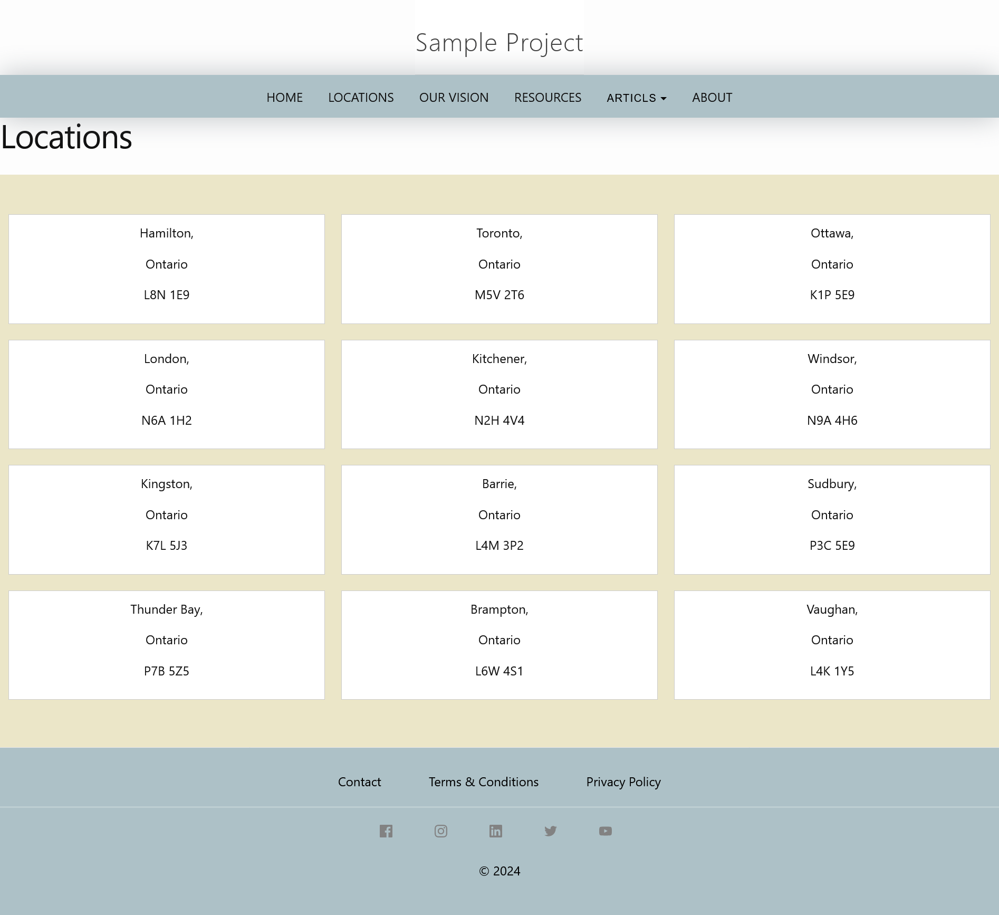

## Steps to create a page that loads data from a data file

In this section, you will be provided with steps to create a `locations.md` page that loads data from the `locations.csv` file, utilizing Jekyll's ability to load data from various file formats like CSV and YAML.

1. **In the `_data` folder, create a data file named `locations.csv`**
    
    An example of the `locations.csv` file content is provided below:

    ```csv
        city,province,postal
        "Hamilton","Ontario","L8N 1E9"
        "Toronto","Ontario","M5V 2T6"
        "Ottawa","Ontario","K1P 5E9"
        "London","Ontario","N6A 1H2"
        "Kitchener","Ontario","N2H 4V4"
        "Windsor","Ontario","N9A 4H6"
        "Kingston","Ontario","K7L 5J3"
        "Barrie","Ontario","L4M 3P2"
        "Sudbury","Ontario","P3C 5E9"
        "Thunder Bay","Ontario","P7B 5Z5"
        "Brampton","Ontario","L6W 4S1"
        "Vaughan","Ontario","L4K 1Y5"
    ```

2. **In your Jekyll folder, create a page named `locations.md`**
    
    An example of the `locations.csv` file content is provided below:

    ```markdown
    
    ---
    layout: page
    title: Locations
    permalink: /locations/
    ---
    <ul id="locations-list">
    
    <div class="location-box">
        <p>{{ location.city | split: ', ' | city }},</p>
        <p>{{ location.province | split: ', ' | province }}</p>
        <p>{{ location.postal }}</p>
    </div>
    
    </ul>
    
    ```
3. **In the `custom.scss` file add the code below to customize your `locations.md` page stylesheet.**

    ```css
    /* Locations page */
    #locations-list {
        display: flex;
        flex-wrap: wrap;
        gap: 10px;
        justify-content: space-evenly;
        background: #ebe6c8;
        margin: 0;
        padding: 50px 0;
    }
    .location-box {
        display: flex;
        flex-direction: column;
        border: 1px solid #ccc;
        padding: 10px;
        margin-bottom: 10px;
        width: 400px;
        align-items: center;
        background: white;
    }
    ```

4. Go back to your browser. Your locations page should now look like this: 
    
