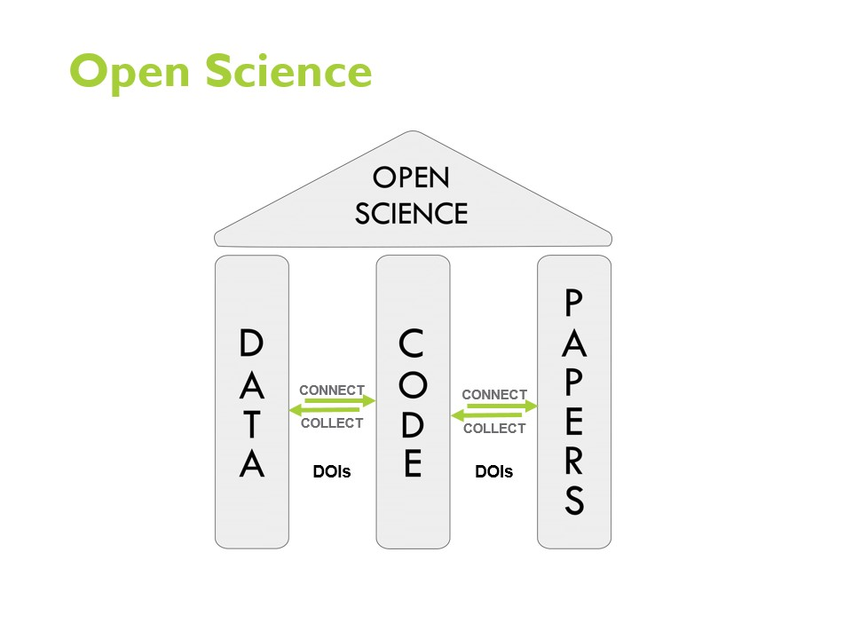

## Digital Object Identifier (DOI)

A Digital Object Identifier (DOI) is a type of persistent identifier (PID) typically assigned to a digital resource, such as an article, dataset, software, or other scholarly work. The DOI provides a persistent and updatable link to the resource, making it easily identifiable and locatable on the internet through a persistent link. DOIs are commonly used in academic and scientific publishing to ensure the permanence and citability of research outputs. They serve as stable and permanent identifiers for digital content, enabling reliable linking, referencing and tracking of scholarly works.  

When accessing a digital object through a DOI link, the [DOI resolve system](https://www.doi.org/) redirects the accessor to the resource's current location. This capability ensures that even if the original location changes (e.g. new host if the old location becomes inaccessabile or unavailabe), users can still access the content using the DOI, which will resolve to a link to the updated location. Each DOI is associated with metadata that provides essential information about the digital object, such as the authors, title, publication date, and publisher. This metadata is permanently stored with the DOI and facilitates accurate and comprehensive citation and discovery of the content.  

The use of DOIs has become a standard practice in scholarly publishing and other digital content distribution platforms, promoting the permanence, reliability and accessibility of research outputs in publications and on the internet.  

  

_Modified image retrieved from [A Practical Guide for Immproving Transparency and Reproducibility in Neuroimaging Research](https://doi.org/10.1371/journal.pbio.1002506​)_  

Open Data, Open Source Software, and Open Publication Access form the foundational pillars of Open Science. DOIs play a crucial role in enabling seamless retrieval and utilization of openly available data by software, while research papers can reliably and accurately reference the software and data employed in the research process. This facilitates findability, promotion of research, verification of results, and data reuse for novel analyses by other researchers.  

### DOI and Research Software

As discussed in the previous section, DOIs ensure the ciability of research outputs, which include research software. DOIs are crucial to the [three levels of reproducible research software](https://mcmasterrs.github.io/lm_reproducible-rs/smp/smp.html#reproducibility-goal): research software for publication, research software as a tool and research software as infrastructure. DOIs are important for all three levels of research software.

Software used for critical or novel elements of the research or results should be cited in the publication. In this case, the specific version of the software used should be referenced. In this way DOIs provide an essential service for these specific citations with preserved meta-data about the software and version, and a location to find this specific software version relevant to the research.

The use of DOIs provides the ability to measure citation counts and usage metrics of the software. These data provide valuable data on how the software is being used in the research community as well as its impact and reach. These data inform future support and development, and document its value to funders and stakeholders.  

When the research software is designed for broader use, using DOIs to cite this infrastracture research software facilitates standardization and consistency, so that results can be compared to like results.

Many funding agencies, journals and institutions are increasingly requiring that research outputs, including software, be assigned DOIs. This requirement helps to ensure compliance with funding requirements as well as to promote best practices in research asset management.  

Research software often have multiple released versions. Each version may contain subtle changes, which can result in different outputs so specific versions of software can be crucial for reproducibility and verification. A DOI can be created for a software project generally, which points to the collection of released and preserved versions of the project. A DOI can also be created for each specific version. DOI systems will link projects and versions bi-directionally making it easy for a link to one to find the other, and each to be presented in the context of the other. In this way DOIs provide a robust mechanism for research software projects and versions: research can reference the specific version of the software used to generate results, which is ideal for publications and citations, and users can easily find a research software project and its latest version for reuse.

DOIs are widely recognized and integrated into academic databases, libraries and indexing services. This integration helps ensure that research software can be found easily, and accessed by researchers across different platforms and disciplines. Some notable examples are [Zenodo](https://zenodo.org/) by CERN (European Organization for Nuclear Research) and the [Research Software Directory](https://research-software-directory.org/) by the Netherlands eScience Center.  
